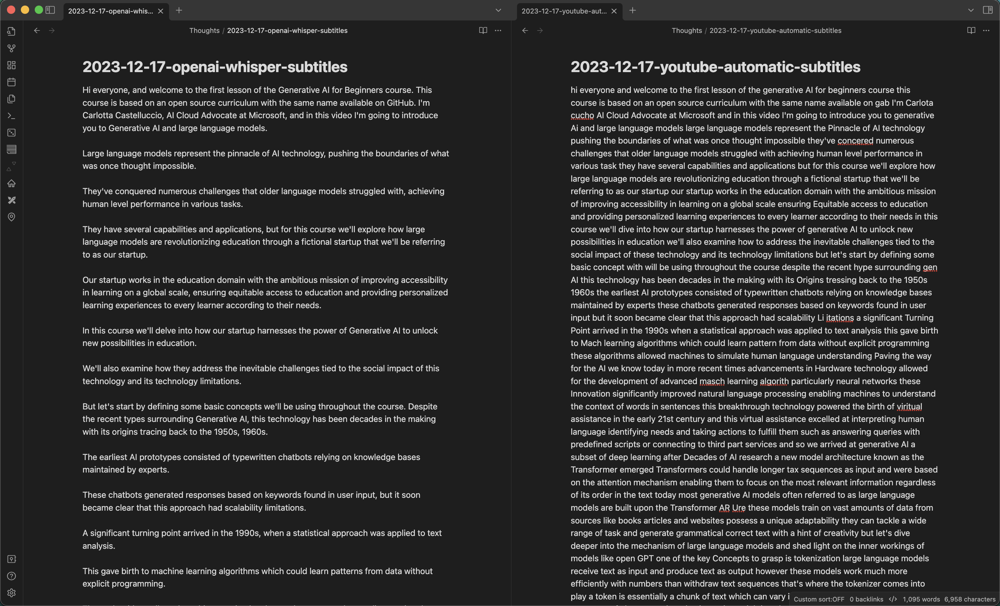

# Notes

As I work through this course, I'm going to write notes here!

## 2023-12-17

### Basic setup

- Forked the [microsoft/generative-ai-for-beginners](https://github.com/microsoft/generative-ai-for-beginners) repo
- Cloned it onto my local machine
- Installed `miniconda` by following [these steps](https://docs.conda.io/projects/miniconda/en/latest/#quick-command-line-install)

### `conda` environment setup

Created `.devcontainer/environment.yml`, with the following contents:

```yaml
name: development
channels:
  - defaults
dependencies:
  - python=3.11.5
  - openai
  - python-dotenv
```

And then, from the root of this project, ran:

```sh
conda env create --name ai4beg --file .devcontainer/environment.yml
```

Followed by:

```sh
conda activate ai4beg
```

### Watching Lesson 01

- For the premise being accessibility of education, and with the recent advances in deep learning and generative algorithms being touted throughout the video, the closed captions on this video are surprisingly inaccurate

- **Tokenizer** is kind of like the grammatical breakdown of a sentence, but it's not exactly grammatical, it's a breakdown to the atomic particles of meaning in a sentence, at least from a machine's perspective. Each token can then be mapped to a number, because computers like to work with numbers.
- Large language models are in the business of taking a prompt, and predicting the _single_ "next token" that should come after the prompt. Once they have that single "next token", they can pretend it was an original token, and repeat the process!
  - Sidebar: how does the large language model know when to _stop_? In other words, how does it know given some input tokens, "okay that's enough tokens, I'm done"? Or to put it in recursion terms... what's the base case here?
- In the context of a "single next token", the "creativity" of large language models doesn't come from the invention of "new" token sequences... but rather, from the _random selection_ among the most probably "single next token" options.
  - Sidebar: is it therefore accurate to say that a large language model will _never_ produce a novel combination of two individual tokens? Or maybe it is possible, because a token with `0` probability could in theory be selected? Or maybe less pedantically... is it accurate to say that the "creativity" of a large language model emerges more readily when there is a combination of the right tuning of "randomness" (meaning, don't always select the most predictable single next token, switch it up a bit) and _longer_ sequences of response tokens (meaning, any given sequence of two tokens is (I think?) very likely to have already occurred at some point in the training data, in fact almost guaranteed to have occurred... while any given sequence of say 100 tokens is very _unlikely_ to have occurred in the training data, in fact almost guaranteed to have _not_ occurred).

#### Generating an `.srt` for the Intro video

- Downloaded the video with [yt-dlp](https://formulae.brew.sh/formula/yt-dlp), like `yt-dlp vf_mZrn8ibc`, with the last bit coming from the URL of the intro video at `https://www.youtube.com/watch?v=vf_mZrn8ibc`
- Converted the downloaded `.webm` to `.mp3` with [ffmpeg](https://formulae.brew.sh/formula/ffmpeg), like `ffmpeg -i input.webm -vn -ab 128k -ar 44100 -y output.mp3`
- Magically got an `.srt` from the `.mp3` with [openai-whisper](https://formulae.brew.sh/formula/openai-whisper)
- I wanted a way to compare this side-by-side with the auto-generated subtitles, so I used `yt-dlp` to grab the auto-generated subtitles as a `.vtt` file, like `yt-dlp --write-auto-subs --no-download vf_mZrn8ibc`. And then converted the resulting `.vtt` file to `.srt` with `ffmpeg`, like `ffmpeg -i autosubs.en.vtt autosubs.en.srt`
- The subtitle files were still annoying to look at side-by-side since they had a lot of timestamp cruft, and repeated text from timestamp to timestamp. I realized I really wanted to see these generated subtitles as a stream of continuous plain text. I wanted something analogous to a plain text script document the video maker might read, rather than plain text telling a playback application what text to display and when.
- Pursuing what I wanted, I noodled on [zchsh/srt-to-plain-text](https://github.com/zchsh/srt-to-plain-text) until I had something I'm happy enough with to demonstrate the difference between YouTube's auto-generated captions and captions generated with OpenAI Whisper.
- Pretty happy with the results here! Microsoft should probably consider using OpenAI Whisper for their subtitle generation for these videos. It might make this educational material a little more accessible!



### Reading Lesson 01

Skimmed through it a bit, but this stood out to me:

> Generative AI is not intelligent - at least in the more comprehensive definition of intelligence, including critical and creative reasoning or emotional intelligence; it is not deterministic, and it is not trustworthy, since fabrications, such as erroneous references, content, and statements, may be combined with correct information, and presented in a persuasive and confident manner.

### Assignment for Lesson 01

The assignment prompt is:

> Try to identify an area where you would add generative AI today that doesn't have it. How would the impact be different from doing it the "old way", can you do something you couldn't before, or are you faster? Write a 300 word summary on what your dream AI startup would look like and include headers like "Problem", "How I would use AI", "Impact" and optionally a business plan.

My knee-jerk and slightly facetious response to this prompt is to drop it into ChatGPT and see what comes out.

#### ChatGPT

ChatGPT came back with a response on revolutionizing education. Coincidence? Perhaps.

```markdown
## Problem

In the field of personalized education, tailoring learning experiences to individual needs remains a significant challenge. Traditional methods rely on standardized curriculum delivery, lacking the adaptability to cater to diverse learning styles and paces. This results in disengagement, limited retention, and unequal educational outcomes.

## How I would use AI

My dream AI startup would focus on revolutionizing personalized education through generative AI. Our platform would analyze students' learning patterns, cognitive styles, and preferences using advanced algorithms. By generating dynamic, adaptive content, such as interactive lessons, quizzes, and simulations, tailored to each student's unique learning trajectory, we'd foster engagement and comprehension.

Our AI would constantly evolve, utilizing natural language processing to comprehend students' responses, adapting content delivery in real time. This would create a responsive learning environment, enabling immediate feedback and adjustments to enhance understanding and retention.

## Impact

The impact of this AI-driven approach to education would be transformative. Students would experience learning as a personalized journey, engaging with materials that resonate with their individual interests and abilities. By accommodating diverse learning needs, we'd bridge educational gaps, empowering students who might otherwise struggle in traditional settings.

Teachers would also benefit, gaining insights into each student's learning process, allowing them to provide targeted support. Moreover, our platform would enable schools to optimize resources, as educators could focus attention where individualized support is most needed.

## Business Plan (Optional)

Our startup would adopt a freemium model, offering basic AI-driven personalized learning tools for free to attract users. Premium features, like in-depth analytics for educators and advanced learning modules, would be available through subscription-based plans.

We'd collaborate with educational institutions to integrate our platform into their systems, ensuring widespread adoption. Continuous improvement through user feedback and AI refinement would be a priority, maintaining our edge in personalized education.

In summary, our dream AI startup would redefine education, leveraging AI to create tailored, engaging learning experiences that empower students, support educators, and revolutionize the educational landscape.
```
